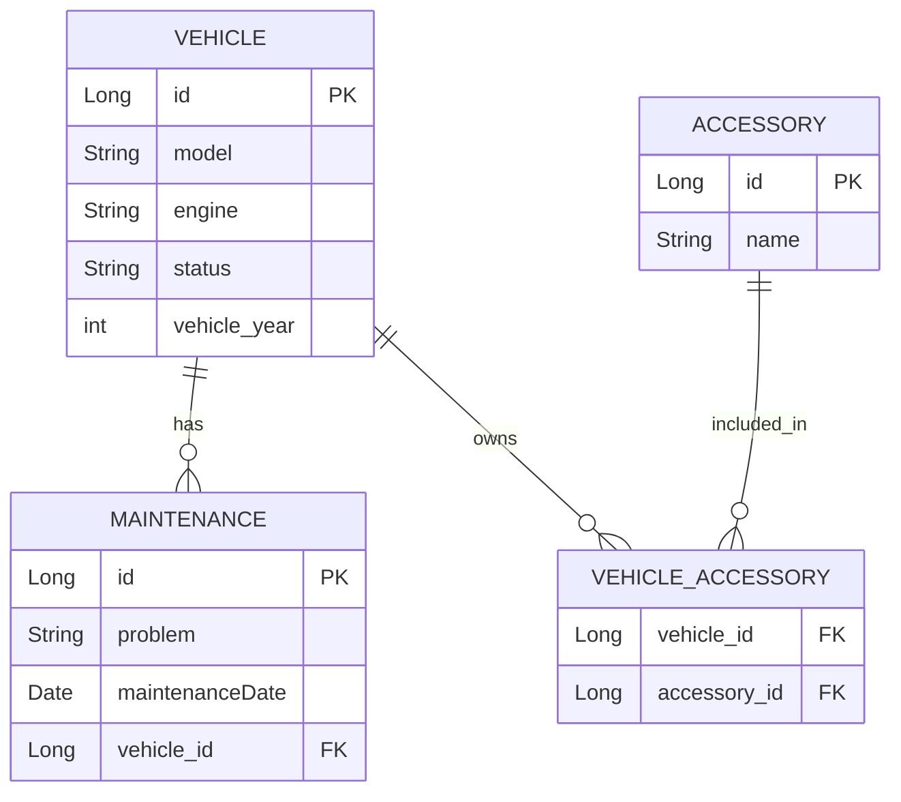

# Próxima aula

## Caso de uso

Preciso agora de mais duas entidades na minha aplicação, eu quero agora controlar as **manutenções** e os **acessórios**.

* Falar sobre `@GeneratedValue`
* Falar sobre o `import.sql`
* Falar sobre RestAssured body Matchers
* Falar sobre profile %test, %prod, %dev
* Falar sobre o `@Table` e como podemos mudar o nome das tabelas no banco de dados

* Usar um banco de dados real como o postgresql com Docker
* Explicar DevServices (eles desligam mesmo tem tempo de desenvolvimento)
* Usar profile de dev para desligar o DevService e ligar em teste
* Explicar relacionamentos (um para um, um para muitos e muitos para muitos) **MOSTRAR a modelagem em desenho**
  * Vamos registrar agora as manutenções do carro (um carro tem muitas manutenções e uma manutenção tem apenas um carro)
  * Vamos registrar agora os acessórios do carro (um carro tem muitos acessórios e um acessório pode estar em muitos carros)
  * Explicar o relacionamento uniderecional e o bidirecional (**REVER**)

## Um para muitos (um veículo pode ter 0 ou n manutenções / uma manutenção é realizada em um e apenas um carro)

## Muitos para muitos (um veículo pode ter 0 ou n acessórios / um acessório pode estar em 0 ou n carros)

## vehicle

| id | model   | engine | status       | vehicle_year |
|----|---------|--------|--------------|---------------|
| 1  | Onix    | 1.0    | RENTED       | 2023          |
| 2  | Corolla | 2.0    | AVAILABLE    | 2022          |
| 3  | HB20    | 1.6    | MAINTENANCE  | 2021          |

---

## accessory

| id | name            |
|----|-----------------|
| 1  | GPS             |
| 2  | Airbag Extra    |
| 3  | Sound System    |
| 4  | Reverse Camera  |
| 5  | Roof Rack       |

---

## 🔗 vehicle_accessory (Tabela de Junção)

| vehicle_id | accessory_id |
|------------|---------------|
| 1          | 1             |
| 1          | 3             |
| 2          | 1             |
| 2          | 2             |
| 2          | 4             |
| 3          | 3             |
| 3          | 5             |



## Consultas SQL para Muitos-para-Muitos (Veículo <-> Acessório)

### 1. Buscar todos os acessórios de um veículo

```sql
SELECT a.*
FROM accessory a
JOIN vehicle_accessory va ON a.id = va.accessory_id
WHERE va.vehicle_id = :vehicleId;
```

### 2. Buscar todos os veículos que possuem um acessório específico

```sql
SELECT v.*
FROM vehicle v
JOIN vehicle_accessory va ON v.id = va.vehicle_id
WHERE va.accessory_id = :accessoryId;
```

### 3. Buscar veículos com seus respectivos acessórios

```sql
SELECT v.id AS vehicle_id, v.model, a.name AS accessory_name
FROM vehicle v
JOIN vehicle_accessory va ON v.id = va.vehicle_id
JOIN accessory a ON a.id = va.accessory_id
ORDER BY v.id;
```

## Relacionamento unidirecional e bidirecional

### Quando Usar e Quando Evitar Relacionamentos Bidirecionais com JPA

Relacionamentos bidirecionais em JPA permitem a navegação entre entidades nos dois sentidos (por exemplo, `Vehicle` → `Maintenance` e `Maintenance` → `Vehicle`). Apesar de úteis, eles devem ser usados com cuidado.

---

## Quando usar relacionamentos bidirecionais

1. **Navegação frequente em ambos os lados**  
   Quando a lógica do negócio exige acessar ambas as entidades de forma recorrente.  
   *Exemplo:* um veículo com várias manutenções, e também uma manutenção que precisa saber de qual veículo ela veio.

2. **Exibição de dados em ambos os lados (DTOs compostos)**  
   Quando a visualização exige informações da entidade "pai" e da "filha".

3. **Sincronização em memória entre as entidades**  
   Útil quando é importante manter os dois lados atualizados no modelo de domínio, sem depender de queries adicionais.

---

## Quando evitar relacionamentos bidirecionais

1. **Navegação ocorre majoritariamente em um único sentido**  
   Criar o outro lado do relacionamento se torna redundante e adiciona complexidade desnecessária.

2. **Sincronização dos dois lados não é importante**  
   Você precisará manter os dois lados sincronizados manualmente (ex: `vehicle.getMaintenances().add(...)`), o que pode gerar bugs se esquecido.

3. **Simplicidade e performance**  
   Quanto mais relacionamentos bidirecionais, mais complexidade na serialização (ex: problemas com `StackOverflowError` ao usar JSON) e mais esforço para manutenção.

---

## Dica

Se optar por usar um relacionamento bidirecional, **sempre defina o lado "dono" com `@ManyToOne` e o lado inverso com `mappedBy` no `@OneToMany`**. Mantenha os métodos auxiliares sincronizados (ex: `addMaintenance(Maintenance m)` e `m.setvehicle(this)`).

```java
@Entity
public class vehicle {
    @OneToMany(mappedBy = "vehicle", cascade = CascadeType.ALL, orphanRemoval = true)
    private List<Maintenance> maintenances = new ArrayList<>();

    public void addMaintenance(Maintenance m) {
        maintenances.add(m);
        m.setvehicle(this);
    }
}

@Entity
public class Maintenance {
    @ManyToOne
    @JoinColumn(name = "vehicle_id")
    private vehicle vehicle;
}
```

### Artigos super interessante sobre relacionamentos

* <https://vladmihalcea.com/the-best-way-to-map-a-onetomany-association-with-jpa-and-hibernate/>
* <https://vladmihalcea.com/the-best-way-to-use-the-manytomany-annotation-with-jpa-and-hibernate/>

### Bean validation

* Como instalar o bean validation
* Como anotar as classes com as anotações do bean validation
* Como utilizar o `@Valid`
* Como utilizar o `ConstraintValidator`:

```java
import jakarta.validation.ConstraintViolation;
import jakarta.validation.Validator;

import javax.enterprise.context.ApplicationScoped;
import java.util.Set;

@ApplicationScoped
public class UsuarioService {

    private final Validator validator;

    public UsuarioService(Validator validator) {
        this.validator = validator;
    }

    public void validarUsuario(Usuario usuario) {
        Set<ConstraintViolation<Usuario>> violationSet = validator.validate(usuario);
        if (!violacoes.isEmpty()) {
            StringBuilder mensagemErro = new StringBuilder("Erro(s) de validação:\n");
            for (ConstraintViolation<Usuario> violation : violationSet) {
                mensagemErro.append(String.format("%s: %s%n", violation.getPropertyPath(), violation.getMessage()));
            }
            throw new IllegalArgumentException(mensagemErro.toString());
        }
    }
}
```

* Criando sua própria validação
* Utilizando `ExceptionMapper`
* Utilizando `ServerExceptionMapper`
